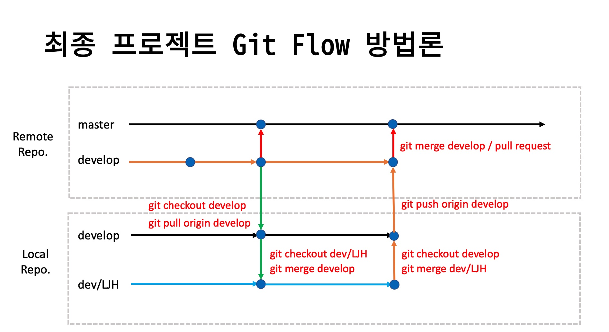

# KOCCA 디지털MICE 실감콘텐츠 - 최종 프로젝트

### 프로젝트 팀
|  팀   | 프로젝트 명                       |   팀명   |  팀원  |              팀장              | 사용기기 | 발표자 |
| :---: | :---------------------------- | :------: | :---- | :---- | :------: | :----: |
|  1팀  |KAMP|핑스몬|이소현, 천경빈,이태형||Quest2||
|  2팀  |The Door||최희원,최소이|최희원|Android Mobile||
|  3팀  |EULJIRO||유주현,김민수,김유진,이초월|김유진|Web||
|  4팀  |||||||


### 프로젝트 일정

| 일정             | 기간          |
| :--------------- | :------------ |
| **개발 기간**    | 09/28 ~ 11/04 |
| **중간 점검**    | 10/21      |
| **발표 문서작성** | 11/01 ~    |
| **발표 리허설**   | 11/?? (10:00 ~) |
| **시연 및 발표** | 11/??  |


### 프로젝트 설계

1. 전체 흐름도(App Flow, Story Board)
2. Screen Design
3. UI Design
4. 기능 명세서(구현 기능 목록)

### Git Flow



- 작업 시작하기 전 깃 작업

```shell
# 로컬 조장소가 develop 브랜치인지 확인
git branch

# 만약 develop 브랜치가 아닌경우 develop 브랜치로 체크아웃
git checkout develop

# 원격 저장소의 develop 브랜치에서 가져오기(Pull)
git pull origin develop

# 충돌(Conflict)가 발생한 경우 해결한 후 Merge Commit 한다.
git add .
git commit -m "충돌해결 - 내용"

# 정상적으로 pull이 완료된 후 자신의 개발 브랜치로 체크아웃
git checkout dev/LJH

# 로컬 develop 저장소의 변경사항을 자신의 개발 브랜치로 Merge 한다.
git merge develop

# 충돌(Conflict)가 발생한 경우 해결한 후 Merge Commit 한다.
git add .
git commit -m "충돌해결 - 내용"

# 정상적으로 병합이 완료된 후 작업을 진행한다.

```

- 작업 종료 후 깃 작업

```shell
# 자신의 개발 브랜치의 작업내용을 모두 커밋한다.
git add .
git commit -m "작업 내용"

# 로컬 develop 브랜치로 체크아웃한다.
git checkout develop

# 자신의 개발 브랜치의 내용을 로컬 develop 브랜치로 병합(merge) 한다.
git merge dev/LJH

# 충돌(Conflict)가 발생한 경우 해결한 후 Merge Commit 한다.
git add .
git commit -m "충돌해결 - 내용"

# 충돌을 해결하거나 정상적으로 병합이 완료된 경우 원격 develop 브랜치로 push 한다.
git push origin develop

# 만약 원격 리포지토리에 변경 사항이 있을 경우 먼저 Pull 한 후 Push 한다.
```
